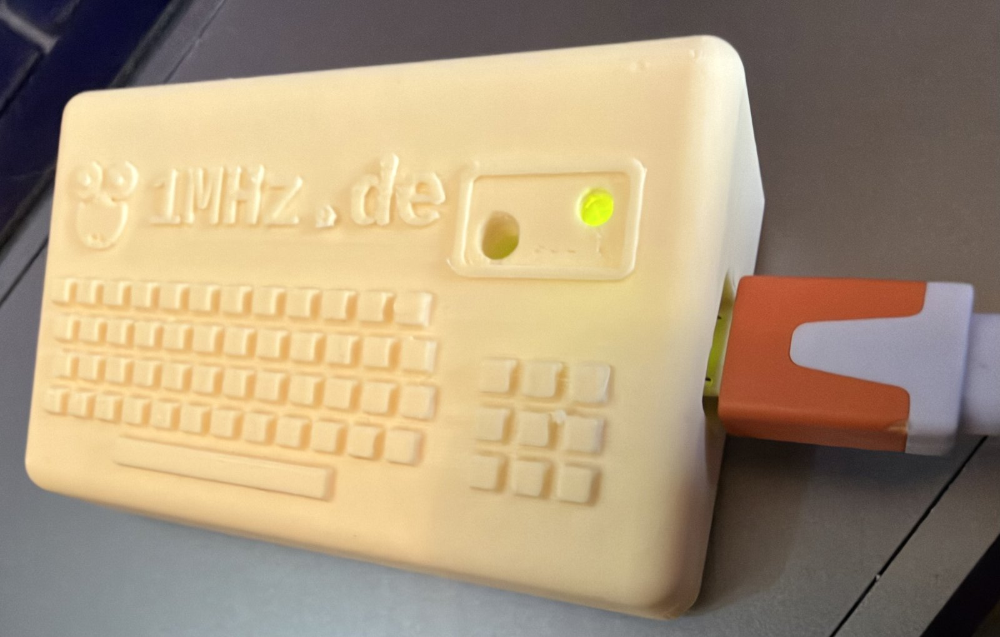
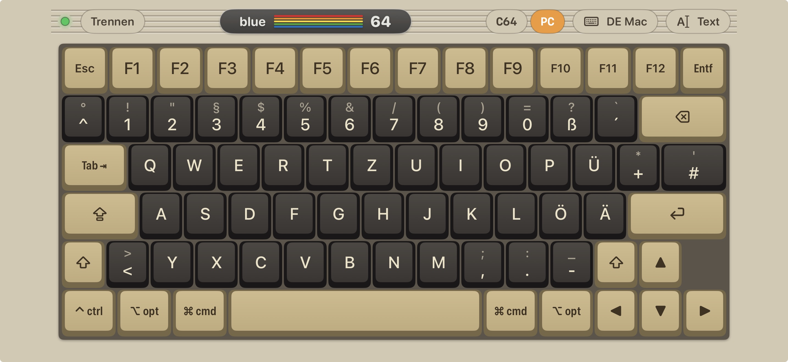
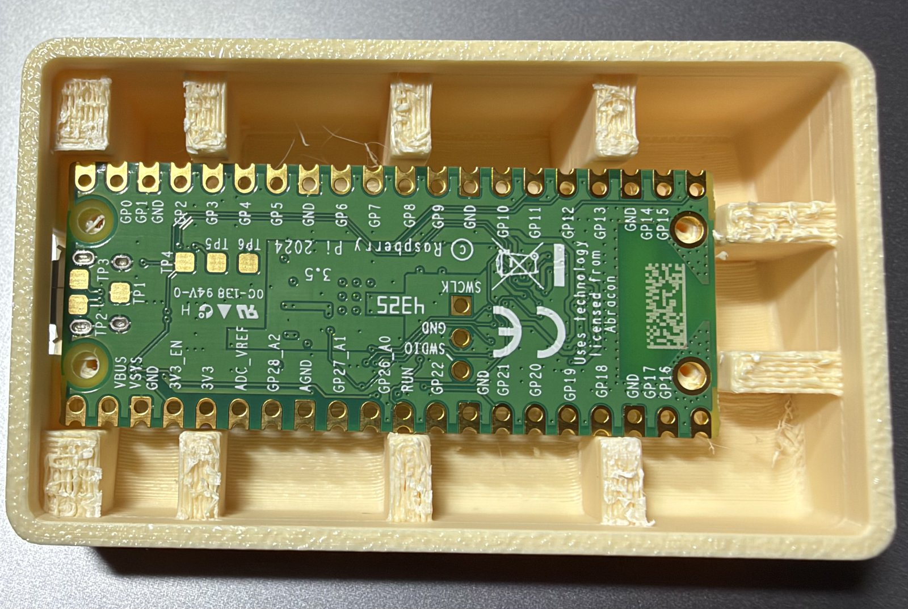
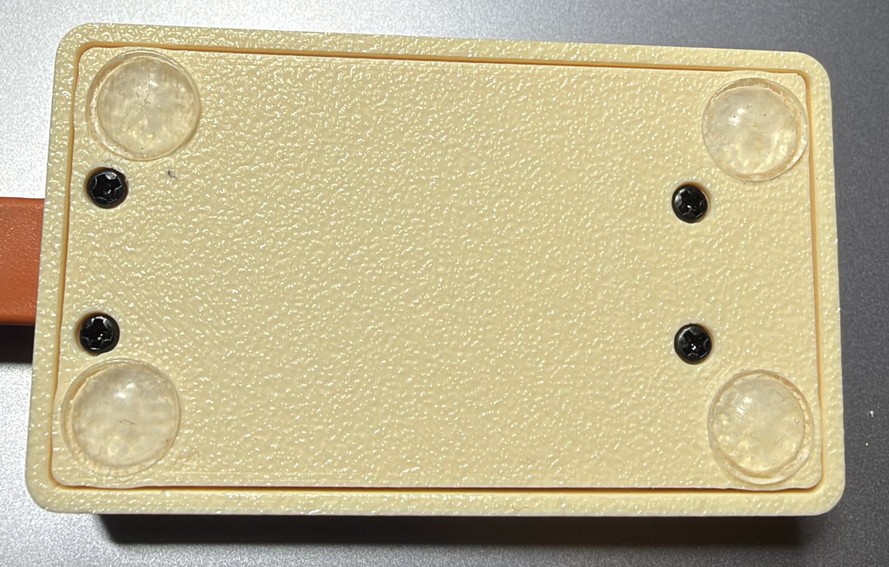

# Pico USB Keyboard

*Deutsche Fassung: [README.de.md](README.de.md)*

Your phone as a **USB keyboard** – with nothing but a **Raspberry Pi Pico 2 W** and a USB cable.
The Pico talks to the [Blue-64 Keyboard app](https://github.com/do2mad/blue64-keyboard-ios)
(iPhone and Android) via Bluetooth LE and shows up as a normal USB keyboard on the computer it is
plugged into. No soldering, no wiring, no driver.

**Get the app:** iPhone – [TestFlight beta](https://testflight.apple.com/join/jEn4tsP7) · Android – [APK in the latest release](https://github.com/do2mad/blue64-keyboard-ios/releases/latest)

Handy wherever a full keyboard is too much: a MiSTer, a Raspberry Pi, a media PC, an emulator
like VICE, quick input on the go.





## Two modes

The app shows a **C64 / PC** switch when it is connected to a Pico USB Keyboard.

**PC mode** – a normal PC or Mac keyboard in the app:

- Layouts: **US**, **German (PC)**, **German (Mac)**, **US (Mac)** – set the same layout on the computer
- Ctrl, Alt, Win / Cmd, AltGr / Option, Esc, F1–F12, Del, cursor keys, Caps Lock, up to 6 keys at once
- Modifier keys: tap = for the next key, double tap = locked, tap again = off
- While Shift / Option / AltGr is active the keys show the character that will be typed
- **Text and snippets** are typed with the chosen layout (umlauts, `@ € { } [ ] \ | ~` included);
  the app keeps separate snippets for C64 and PC

**C64 mode** – the C64 keyboard of the app, made for the **MiSTer C64 core**. The C64 keys are
sent as the PC keys the core expects, so every C64 key works – also with SHIFT and C=:

| C64 | PC key | C64 | PC key |
|---|---|---|---|
| RUN/STOP | Esc | RESTORE | F11 |
| C= | Tab | CTRL | left Ctrl |
| £ | `\` | ← | `` ` `` |
| ↑ | F9 | `=` | End |
| `@` | `[` | `*` | `]` |
| `:` | `;` | `;` | `'` |

Digits 1–5 go via the keypad, 6–0 via the main row (the core ignores keypad 6–0 and remaps
SHIFT + digit for a US layout – the firmware takes this into account).

## Getting started

1. **Flash the firmware** – hold BOOTSEL on the Pico 2 W, plug it into a computer, drag
   `pico-usb-keyboard-vX.Y.Z.uf2` from the [latest release](https://github.com/do2mad/pico-usb-keyboard/releases/latest)
   onto the `RP2350` drive.
2. **Plug the Pico** into the computer / MiSTer you want to type on.
3. **Open the app** – it finds **Pico USB Keyboard** by itself. LED blinking = waiting,
   LED on = connected.
4. Choose **C64** or **PC** at the top, and in PC mode the keyboard layout.

> **Mac:** macOS may open the "Keyboard Setup Assistant" the first time – close it. The firmware
> already takes care of the two keys macOS swaps on unknown keyboards.

Debug output (optional): UART0 on GP0 (TX) / GP1 (RX), 115200 baud.

## Case (3D print)

A small retro-style case with the 1MHz.de logo – files in [case/](case/):

| File | |
|---|---|
| `top-numpad-statusbar.stl` | top with number pad and frame around LED / BOOTSEL (as in the photo) |
| `top-numpad.stl` / `top-statusbar.stl` | the two other variants |
| `bottom.stl` | bottom plate (same for all variants) |
| `pico-usb-keyboard-case.scad` | OpenSCAD source (`variant = "numpad" / "status" / "both"`) |

- **Parts:** Raspberry Pi Pico 2 W **without** pin headers, 4 × self-tapping screws **M1.7 × 10**
  (× 8 works too), 4 self-adhesive rubber feet Ø 8 mm (optional)
- **Printing:** PLA or PETG. Bottom plate flat. Top **open side down** with supports
  "on build plate only" (for the sloped roof). 0.2 mm layers work; **0.08 mm** gives a much
  nicer logo and keys.
- **Assembly:** put the Pico upside down into the top – the ribs centre it –, put the bottom
  plate on and screw both together through the Pico's four mounting holes.
- The LED shines through the small hole; BOOTSEL can be pressed through the larger one with a
  paper clip (firmware update without opening the case).

| Inside | Bottom |
|---|---|
|  |  |

Changing the case: OpenSCAD (the 1MHz.de lettering uses the font *Liberation Mono Bold*).

## Bluetooth protocol

Same service as [Pico64 Keyboard](https://github.com/do2mad/pico64-keyboard) and the BT-64 BLE
keyboard extension (`C64B0001-B1E6-4A64-9C64-6B7E3F1A2D00`), so the app works with all three.
Additions for the PC mode:

| Characteristic | Content |
|---|---|
| `C64B0006` | USB key state `[modifiers, key1 … key6]` (USB HID usage IDs), write / write without response |
| `C64B0007` | PC text `[flags, layout, UTF-8 …]`, flags bit0 first / bit1 last chunk, layout 0 US, 1 DE (PC), 2 DE (Mac), 3 US (Mac) |
| `C64B0004` | info byte 2 (capabilities): bit0 full matrix, bit1 USB key states, bit2 PC text |

The C64 characteristics (`C64B0002` key, `C64B0003` text, `C64B0005` full matrix) are described in
the [Pico64 protocol](https://github.com/do2mad/pico64-keyboard/blob/main/docs/PROTOCOL.md).

## Building

Pico SDK 2.2.0 **with the `tinyusb` submodule** (`git submodule update --init lib/tinyusb`),
ARM GCC, CMake:

```sh
cd firmware
cmake -S . -B build && cmake --build build      # -> build/pico-usb-keyboard.uf2
```

`hid_out.c` turns the C64 key states into USB HID reports, `pc_keys.c` handles the PC mode.
The key scheduler (`keys.c`) and the text feed (`textfeed.c`) come from Pico64 Keyboard.

## USB ID

The firmware still uses the pid.codes test ID `1209:0001`. A dedicated ID (`1209:C64B`) has been
requested at pid.codes and will be used as soon as it is assigned.

## License

Firmware and documentation: MIT – see [LICENSE](LICENSE) and [NOTICE](NOTICE).
Case (folder `case/` and the photos): CC BY-NC-SA 4.0 – see [LICENSE-CASE.md](LICENSE-CASE.md).
Made by Martin Oswald (do2mad) –
[1mhz.de](https://1mhz.de).
